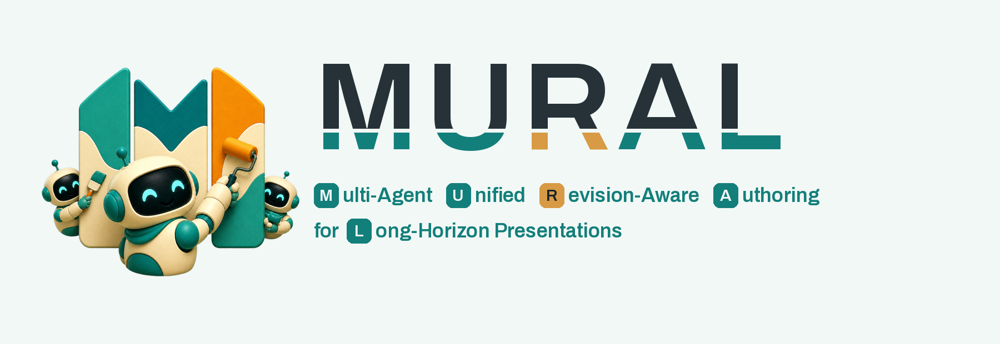
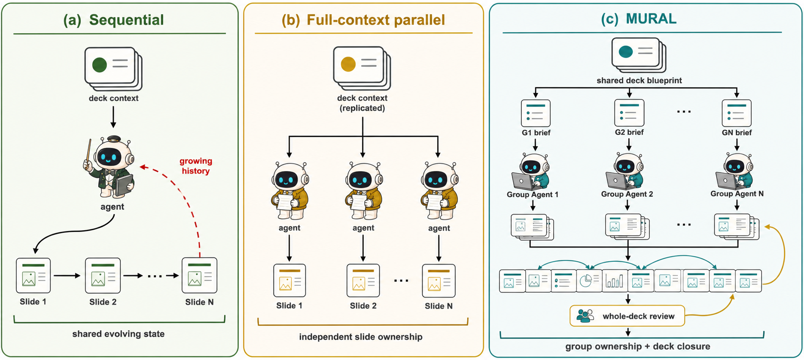
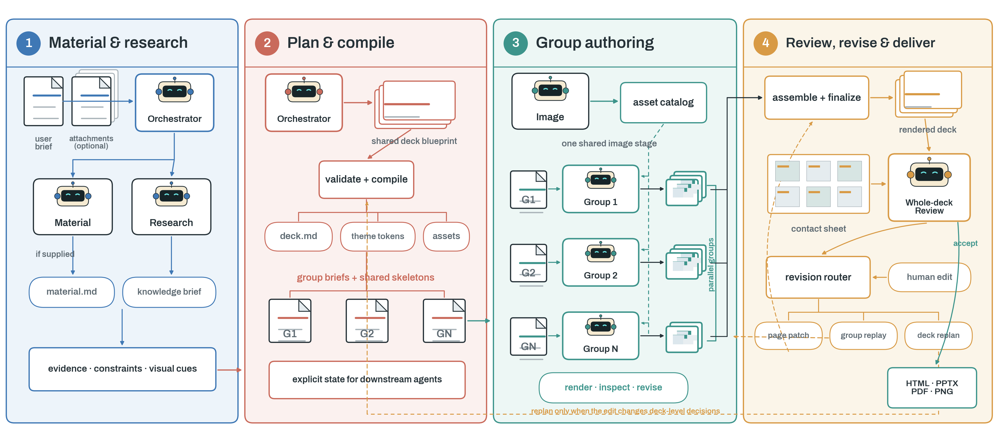

  

  <strong>Lifecycle authoring for editable, long-horizon presentations.</strong>

  <a href="README.md">English</a> ·
  <a href="README_zh-CN.md">简体中文</a> ·
  <a href="blog/introducing-mural.md">Project story</a> ·
  <a href="site/public/mural-paper.pdf">Paper draft</a> ·
  <a href="apps/studio/sensenova_present/README.md">SenseNova Present WebUI</a> ·
  <a href="docs/thread-bench.md">THREAD-Bench</a>

> [!NOTE]
> This repository is currently a **research preview**. It publishes the project narrative,
> system diagrams, brand assets, implementation scaffold, and the runnable **SenseNova Present**
> authoring WebUI. Full generation still relies on separately configured runtimes and model
> services. The reusable MURAL runtime, MURAL Authoring Skill, THREAD-Bench cases, training
> data, checkpoints, and measured results remain gated until their versions and public-use
> boundaries are frozen.

## The name is the method

| Letter | Stands for | Method implication |
| :---: | --- | --- |
| **M** | **Multi-Agent** | Specialist roles can run in parallel without making every slide an isolated task. |
| **U** | **Unified** | A shared deck blueprint carries audience, evidence, terminology, narrative, and design decisions. |
| **R** | **Revision-Aware** | Work resumes at page, group, or deck scope according to the edit's actual impact. |
| **A** | **Authoring** | The reusable object is an executable lifecycle, not a one-shot image-generation prompt. |
| **L** | **Long-Horizon Presentations** | Decisions must survive across stages, distant slides, and later revision turns. |

> **MURAL does not merely split a long workflow. It aligns agent ownership with the deck's
> dependency structure, then restores whole-deck closure after parallel production.**

## At a glance

**MURAL-Presenter** (MURAL for short) is a Skill-driven multi-agent framework for the full lifecycle of editable HTML
presentations. It treats presentation creation as an authoring process rather than a one-shot
rendering problem: understand the request, ground materials and facts, plan the deck, prepare
assets, author related slides, inspect rendered pixels, review the assembled deck, revise it,
and export the result.

Here, **long horizon** refers to the distance over which a decision must remain valid across
stages, slides, and revision turns. An audience assumption set at the beginning may shape an
entire deck; a definition introduced on slide 3 may be consumed on slide 18; a later edit may
need to update several related slides without disturbing the rest.

- **Shared state, scoped views.** Global decisions are externalized once and projected into
  group and page briefs instead of being reconstructed from a growing conversation.
- **Slide-group ownership.** Narratively or visually dependent pages have one accountable
  producer and one joint render–inspect–revise loop, even when the pages are non-contiguous.
- **Revision-aware continuation.** Later edits reuse the same lifecycle and restart only the
  smallest scope that can reliably preserve deck-level decisions.

## The missing middle: deck → slide group → page

Single-agent authoring preserves one continuous context, but its execution history grows with
the deck and later edits. Per-slide parallelism shortens each trajectory, but moves cross-slide
relationships into state handoffs between independent workers. This is a responsibility problem,
not merely a scheduling problem. MURAL inserts a middle unit: the **slide group**.

Slides that share a narrative responsibility, visual system, asset series, or explicit
dependency are assigned to one Group Agent for joint authoring and inspection. Different groups
can still run in parallel. After assembly, a whole-deck review restores the global view.

  

<em>Figure 1. MURAL assigns dependency-related slides to shared Group Agents and restores whole-deck closure after parallel authoring.</em>

## Full-lifecycle authoring

MURAL externalizes the lifecycle as the reusable **MURAL Authoring Skill**:

1. **Material and research** organize optional attachments and close decision-relevant evidence gaps.
2. **Plan and compile** establish a shared deck blueprint, design system, page map, and complete slide groups.
3. **Group authoring** uses one centralized image stage, then lets Group Agents jointly author and inspect related slides.
4. **Review, revise, and deliver** assemble the deck, run whole-deck review, route later edits by impact scope, and export deliverables.

  

<em>Figure 2. The MURAL Authoring Skill spans material grounding, deck planning, group authoring, whole-deck review, impact-aware revision, and multi-format delivery.</em>

The revision router selects the smallest reliable scope:

- **Page patch** for a precisely local change.
- **Group replay** when several related slides or their shared visual language must change.
- **Deck replan** only when the request changes deck-level decisions or structure.

## Why HTML?

MURAL uses HTML/CSS/SVG as its authoring source so that text, layout, graphics, media, and
interactions remain separately addressable. Browser rendering provides the pixel-level ground
truth for inspection, while the structured source supports targeted revision. PPTX, PDF, and
images are delivery adapters; export fidelity is evaluated rather than assumed.

## Evaluation

We are developing **THREAD-Bench** — *Tracking Holistic Requirements and End-to-End Alignment
in Decks* — to evaluate both process evidence and the final artifact. Its intended scope includes
knowledge accuracy, deck- and page-level presentation quality, and case-specific long-range
dependencies. PresentBench and SlidesGen-Bench cover complementary generation quality, while
DECKBench supplies multi-turn revision tasks.

No MURAL effectiveness number is public yet. See [Release status](docs/release-status.md) for the
evidence boundary and [THREAD-Bench overview](docs/thread-bench.md) for the planned protocol.

## Repository map

| Path | Contents |
| --- | --- |
| [`src/mural_presenter/`](src/mural_presenter/) | Reserved Python core: query synthesis, data preparation, orchestration, inference, rendering, and QC |
| [`configs/`](configs/) | Versioned, non-secret configuration and query-pool contracts |
| [`apps/studio/`](apps/studio/) | Integrated SenseNova Present WebUI for authoring, review, revision, and export, plus its deployment adapters |
| [`services/api/`](services/api/) | Target extraction boundary between the WebUI and reusable MURAL runtimes |
| [`scripts/`](scripts/) | Thin future CLI entrypoints; reusable logic belongs in `src/` |
| [`tests/`](tests/) | Unit, integration, end-to-end, and fixture conventions |
| [`data/`](data/) | Dataset layout and release rules; generated data is not committed |
| [`artifacts/`](artifacts/) | Run-artifact contract; generated runs and exports are ignored |
| [`skills/mural_authoring/`](skills/mural_authoring/) | Reserved public home of the MURAL Authoring Skill |
| [`benchmarks/thread_bench/`](benchmarks/thread_bench/) | Reserved public home of THREAD-Bench cases, judges, and aggregation |
| [`assets/logo/`](assets/logo/) | Primary mascot, compact mark, lockups, and reproducible exports |
| [`assets/figures/`](assets/figures/) | Publication figures in PNG and PDF |
| [`docs/`](docs/) | Method, benchmark, branding, and release notes |
| [`blog/`](blog/) | Platform-neutral English and Chinese launch articles |
| [`site/`](site/) | Deployable bilingual **project website and blog**, distinct from the product Web UI |
| [`tools/`](tools/) | Deterministic asset builders, static exporter, and public-release checks |

The module boundaries, expected inputs/outputs, and run-directory contract are documented in
[Repository layout](docs/repository-layout.md).

## Project status

| Component | Status |
| --- | --- |
| Public narrative and system diagrams | Available |
| Brand system | Available |
| SenseNova Present WebUI | Runnable UI-only preview available; full generation runtimes and model services remain external |
| Reusable MURAL runtime modules | Documented scaffold; implementation pending release review |
| Bilingual paper manuscript | Working draft available; results pending |
| MURAL Authoring Skill | Pending version freeze |
| THREAD-Bench | Pending schema and judge calibration |
| Training data and checkpoints | Pending reproducibility and release review |
| Experimental results | Not yet public |

## Contributing

The most useful contributions during the preview phase are corrections to the public description,
reproducible failure cases, benchmark-case proposals, accessibility feedback, and export-fidelity
reports. Please read [CONTRIBUTING.md](CONTRIBUTING.md) before opening an issue or pull request.

## Citation and license

The current [English](site/public/mural-paper.pdf) and
[Chinese](site/public/mural-paper-zh.pdf) manuscripts are working drafts, not archival releases.
Citation metadata, authorship, the archival paper URL, and licenses will be added when the
corresponding artifacts are public. Until then, the absence of a license does **not** grant
permission to redistribute or reuse unreleased implementation or data.
