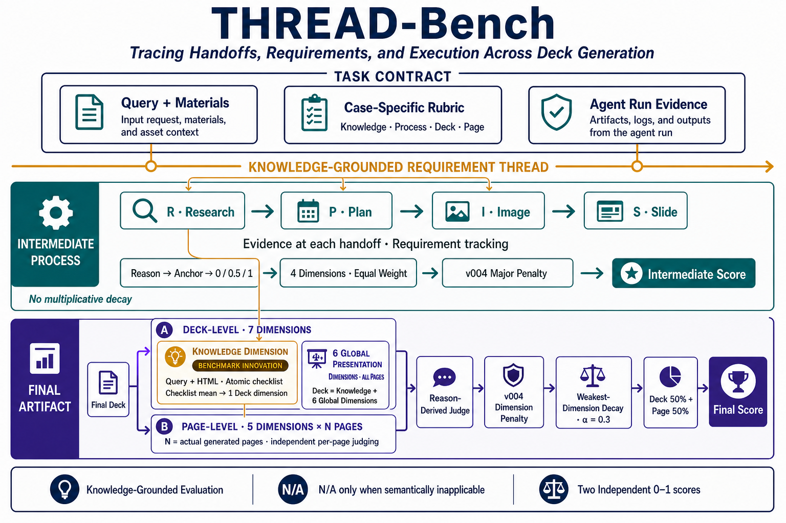

# THREAD\-Bench





流程图PPT文档：[SensePresentBench](https://sensetime.feishu.cn/wiki/AS3fwbP8tiRsozkjWVMcMSAOnac)


名字：

对，`End-to-End` 有些过度概括，而且和 `Handoffs` 语义重复。

通常 “end\-to\-end benchmark” 暗示从用户输入、工具执行、生成、渲染直到交付结果的完整链路都被覆盖。你的 benchmark 更准确的定位是：

- 评价若干关键中间阶段；

- 评价阶段间的 handoff；

- 检查需求是否持续落实；

- 对比中间产物与最终 deck。

它是 process\-aware、long\-horizon，但不必宣称完整 end\-to\-end。

> **THREAD\-Bench: Tracing Handoffs, Requirements, and Execution Across Deck Generation**
> 
> 

对应：

- **T**racing

- **H**andoffs

- **R**equirements

- **E**xecution

- **A**cross

- **D**eck Generation

这个版本很贴合现有设计：

- `Handoffs`：Research → Plan → Image → Slide之间的关键handoff；

- `Requirements`：Query Requirement Manifest 和 case rubric；Query要求在长程执行中的持续保持；

- `Execution`：真实检索、图片准备、页面检查与修改；最终Deck的知识、全局组织与逐页呈现质量。

- `Across Deck Generation`：说明考察范围是 deck 生成过程，而不只是成品。中间过程与最终Deck之间的一致性；


# 第一部分：评测方案设计

## 一、为什么要区分中间过程与最终产物，以及知识质量与呈现质量

### 1\. 中间过程 vs 最终产物

- 中间过程评测：反映 Agent 主动拆解、调研、规划、工具调用和纠错的长程 Agentic 能力，体现的是整个PPT生成的工作流。 主要关注四类可以从轨迹中直接观察的关系：

- 最终产物评测：过程好不等于最终 PPT 好，例如计划没有执行、内容遗漏或排版失败，因此两者缺一不可。 

参考：https://arxiv\.org/html/2603\.22744（long horizon agentic benchmark，用skills要求agent输出中间产物）

### 2\. 知识质量 vs 呈现质量

- 知识质量：PPT 是知识的呈现形式之一，必须保证核心事实、概念和结论正确。 

- 呈现质量考察模型将结构化或非结构化知识转化为高质量 PPT 的能力，具体分为多页呈现和单页呈现。 

- 分开评价可以避免“视觉精美掩盖事实错误”，或者“知识丰富掩盖结构和排版问题”。 

---

## 二、各评测模块分别包含什么

### 1\. **Intermediate：中间过程**

**工作流阶段与 Process Rubric 的对应关系**

（review部分评测比较复杂，先不考虑）

最后大维度：**R、P、I、S 四个阶段，共七条 Rubric**

参考Page展开为每个页面，每个criterion可以进一步展开为语义单元：

- R01按核心研究主题展开；

- R02按预先标记的高风险事实展开；

- P01按Query Requirement Manifest逐项展开；

- P02按整册叙事和当前plan中的逐页任务展开；

- I01、I02按每个实际图片任务展开；

- S01按当前run实际生成的每一页展开。

展开只增加独立检查次数，不改变criterion本身的评分定义。


### 2\. **Final：最终产物**（HTML提取内容 与渲染图片）

最终产物分为两个大部分：

- **多页呈现质量（Deck\-level）**：关注整体故事线、节奏、内容选择、跨页衔接和全局视觉统一。 

    - **知识**：关注核心知识覆盖、事实与数值正确性。 

    - 其他维度（6个）

- **单页呈现质量（Page\-level）**：关注单页的信息层级、图文关系、排版和技术质量，并根据封面页、过渡页、内容页和结尾页区分标准。 

#### 2\.1多页与单页呈现质量（知识转化与展现能力）

这部分考察模型如何将获取到的知识转化为演示文档：

#### **多页呈现质量**

Deck关注整套PPT，所有criterion必须映射到以下六个维度之一：

1. 受众与沟通目标适配；

2. 内容选择与信息密度；

3. 叙事结构与章节过渡；

4. 节奏篇幅与冗余控制；

5. 跨页语义一致性；

6. 全局视觉一致性。

知识checklist先形成一个独立的知识维度，再与上述六个Deck维度一起聚合。因此，当前Deck由**六个呈现维度 \+ 一个知识维度**组成。

Deck必须检查当前run生成的全部页面，不允许抽样。若case要求固定页数，则页数要求由独立criterion检查；全局评测范围仍以实际生成页面为准。

##### 1\.知识质量（事实与逻辑）

知识质量须有明确的来源或锚点，主要包括：

1. 文章或其他形式的附件材料（Material）；

2. 网站或者其他权威性来源；

3. 已有的优质 PPT 参考； 

4. 已有 Benchmark 中整理好的 Query 和 Rubric。 

针对不同任务，知识的考察重点不同：

- **开放研究型任务**：Query 较短，以 Research 和 Plan 为主。知识由 Agent 自主搜索与整理，重点考察最终 PPT 对核心知识的覆盖和正确性。 

- **附件材料型任务**：提供长文本、数据或其他材料。知识主要来自用户材料，重点考察 Agent 是否忠实、完整地提取并呈现在 PPT 中。 

##### 2\.关注整套 PPT 

受众适配、内容选择、叙事结构、篇幅节奏、跨页衔接和全局视觉一致性。 

#### **单页呈现质量**

关注每一页的信息层级、视觉编码、构图排版、字体颜色和技术完整性。 

其核心是通过合理的叙事、页面分配、视觉编码和排版，将知识有效传递给目标受众。


Page关注单页表现，所有case\-specific Page criterion必须映射到以下五个维度之一：

1. 信息层级与密度；

2. 图文关系与视觉编码；

3. 构图、对齐、排版、留白与平衡；

4. 字体、颜色、对比与可读性；

5. 技术完整性与素材质量。

Page采用“criterion × 实际页面”的独立请求：当前run生成多少个canonical pages，就为每个Page criterion执行多少次适用性判断和评分。每次只输入当前页证据，不能先形成整套印象再复制分数。

---

## 三、rubric评分设计及评测流程


### 1\. 整体rubric架构

采用“**通用维度＋任务专属 Rubric（Case\-specific）**”，既保证不同任务可以横向比较，也保证特定任务的评分足够准确。

基于通用的维度去设计 Case\-specific rubric，最后用来评测的只有 Case\-Specific rubric。

1. 通用维度定义benchmark要评价的能力边界；

2. 每个case根据Query、材料和任务特征编写具体criterion；

3. 每个criterion必须明确映射到一个通用维度；

4. 实际Judge只使用Case\-specific rubric；

5. 聚合时先在维度内平均，再在维度之间聚合，不能把所有criterion跨维度平摊。

### 2\. 评测输入

不将所有数据无差别输入评测器，而是根据维度选择输入、按任务最小必要范围选择输入。这里减少的是**无关文件数量**，不是压缩高信息内容。：

- 中间过程质量：输入 `plan.md`、`research.md`、trajectory 和检查记录； 

- 知识质量：仅输入全部 HTML 提取内容； 

- 多页呈现质量：输入全部 HTML 提取内容和全部渲染图； 

- 单页呈现质量：输入当前页 HTML、当前页渲染图和页面类型。 

#### **2\.1 Intermediate输入**

以下文件类型是候选证据来源，不是每个评分点的固定输入。实际输入由Case-specific rubric中每个criterion的`input_bundles`独立声明，只输入区分其评分档位所必需的完整证据；未被当前criterion使用的中间产物不输入。

- R：按criterion选择Query、研究正文、必要研究trace和Plan；R01不输入trace，R02输入相关trace；

- P：Query、Plan以及当前规划单元实际需要的资产证据，不默认输入Research或trace；

- I：当前图片任务对应的需求、搜索/生成trace、catalog、资产和实际使用页面；

- S：当前页面对应的Slide trace和渲染记录；仅当criterion需要独立核对画面时，才输入对应Plan、HTML或诊断图。

#### **2\.2 Knowledge输入**

知识层只输入：

- Query / instruction；

- 全部HTML提取内容。

知识层不输入渲染图。

#### **2\.3 Deck输入**

|Deck维度|输入|
|---|---|
|受众与沟通目标适配|全部HTML提取内容|
|内容选择与信息密度|全部HTML提取内容 \+ 全部渲染图|
|叙事结构与章节过渡|全部HTML提取内容|
|节奏篇幅与冗余控制|全部HTML提取内容|
|跨页语义一致性|全部HTML提取内容|
|全局视觉一致性|全部渲染图|

#### **2\.4 Page输入**

每个逐页请求只输入：

- 当前页HTML提取内容；

- 当前页渲染图；

- 当前页面类型。


### 可选Preaudit

> 原因：发现judge model对于审美、整体等这种需要模型自己分析给分的rubric，给分容易偏高，或者理由和给分不一致
> 
> 


所以采用先用一个preaudit model（目前用的gemini\-3\.1\-pro\-preview/gpt\-5\.6\-terra），先对输入评测内容（不给rubric）直接检查分析缺陷

这个是个可选项，目前发现加上这个分数确实会更准一些

Final可以开启Preaudit：

1. Preaudit先检查整套最终产物；

2. 只记录检测到的内容或视觉缺陷；

3. 正式Judge只接收与当前criterion相关的缺陷，不接收完整预审分析；

4. Preaudit不直接决定分数，正式Judge仍须根据criterion证据和anchor完成判断。

Preaudit是可选项，不改变Rubric本身的评分定义。


### 评分分数设计

分两类分数：

- 确定性的评分点：要么有要么没有：0/1

    - 知识层的checklist也算在这里

- 其他：0/0\.5/1


不能让judge先给分数再给理由，这样我发现理由是准的，但分数偏高 =》

Judge不先给一个分数再补理由，而是：

1. 阅读当前单元的完整证据；

2. 对每个评分anchor给出是否匹配及理由；

3. 形成证据和缺陷分析；

4. （代码）根据唯一命中的anchor派生`0 / 0.5 / 1`或`0 / 1`。


#### 3\.1 知识层评分法

将知识拆解为独立、原子的 Checklist，采用 `0 / 1` 二元评分。

#### 3\.2 多页与单页评分法

- 确定性要求采用 `0 / 1` 评分； 

- 主观质量要求采用三档评分： 

    - 1分：优秀； 

    - 0\.5分：基本可用，但存在局部问题； 

    - 0分：存在严重问题。 

#### 3\.3 **N/A语义边界**

`N/A`只表示Query语义上不要求当前对象或过程，例如没有科学示意图的页面不适用“科学示意图结构”criterion。

以下情况不能判为`N/A`：

- Query明确要求，但模型没有生成；

- 过程应该发生，但证据缺失；

- 资产任务规划后没有执行；

- 页面或中间产物遗漏。

适用单元缺失应按anchor评分。`N/A`单元不进入平均，也不触发缺陷扣分。

#### 3\.3 基础分数聚合


同时设置必要的封顶规则，例如最终产物完全无法渲染或内容严重跑题时，对总分进行限制。


目前最终只输出两组总分，二者不再合并：

- `final_output_case_specific`

- `intermediate_case_specific`


整体顺序是：

> 原子单元/页面评分 → criterion平均 → 小维度原始分 → v004重大缺陷扣分 → 组内维度聚合 → Final组级衰减 → 输出两组总分
> 
> 

**1\. 单元到criterion**

对于展开型criterion \(c\)：

$C_c = \frac{1}{|U_c|}\sum_{u\in U_c} s_u$

其中，\(U\_c\)只包含适用单元；`N/A`不进入分母。

**2\. Criterion到小维度**

每个criterion只能属于一个维度。当前维度内criterion等权：

$D_d^{raw}=\frac{1}{|C_d|}\sum_{c\in C_d}C_c$


##### 3\.1\.1 最终产物分数

设：

- $K$：Knowledge 维度分

- $Deck$：原 Deck\-level 维度分

- $P$：Page\-level 维度分

最终产物总分：

$\boxed{Final=0.5\times Deck+0.5\times Page}$


###### Deck\-level

$Deck_{raw}=\frac{D1+D2+\cdots+D6+K}{7}$

之后根据后面新增的 defect policy 扣分机制得到最终分数 $Deck$。


**Knowledge：**

checklist多少条就等权平均

$K=\operatorname{mean}(K1,\ldots,Km)$

m是当前这个case的knowledge checklist中的数量


**其他维度：**

同knowledge，还有共 5 个 Deck criterion，也是维度内评分点先求平均，得到每个维度分


###### Page\-level

共5个维度，每个维度内部所有case criterion分数取平均，每个 criterion 都会产生 $页面数$ 个独立页面结果。


对于第i个维度的第 $j$ 个 Page criterion：

$Page_{ij}=\frac{\sum_{\text{适用页面}}Page_{ij,p}} {\text{适用页面数量}}$

然后该维度分数

$Page_{i}=\frac{\sum_{\text{所有评分点}}Page_{ij}} {\text{该维度在当前case的criterion数量}}$

N/A 页面不进入分母。

再对 5 个 Page criterion 等权平均：

$Page_{\text{raw}}=\frac{1}{5}\sum_{j=1}^{5}Page_i$


随后再执行 defect 扣分，得到最终的 $Page$。


**Final组级最弱维度衰减**

为避免一个明显短板被其他高分维度完全平均掉，Deck和Page各自只执行一次：

$G_{effective}=G_{base}\times[1-\alpha(1-G_{min})]$

当前：

$\alpha=0.3$


其中$G_{min}$为当前组内最低小维度分。该衰减只用于Final的Deck和Page，Intermediate不执行。


##### 中间产物分数

中间产物有四个大维度：

- Research

- Plan

- Image

- Slide

当前各组 criterion 数量为：

类似Page评分方式：

1. 每个展开的语义单元先独立评分：例如 S01 是逐页平均、I02 是逐图片任务平均。

2. 再在小维度（目前这个动物罗盘的case是一个小维度内只有一个criterion）内等权平均。

3. 对小维度分执行重大缺陷扣分。

4. 扣分后的小维度聚合为 4 个大维度。

    Research = `mean(R01, R02)`

    Plan = `mean(P01, P02)`

    Image = `mean(I01, I02)`

    Slide = `S01`

最后四个大维度之间没有显式特殊权重，采用等权平均：

$\boxed{Intermediate=\frac{Research+Plan+Image+Slide}{4}}$

四个维度正常情况下各占 25%；原有 N/A 排除规则保持不变。

因此正常情况下每个维度权重都是 0\.25。


> 注意：如果某个维度的所有 criterion 都是 N/A，如生图任务：例如完全没有图片任务导致 Image 整组无适用分数
> 
> - 如果query中没有明确要求是否要生图/这个case不需要：那么该组会被排除，不算分，剩余三个维度重新等权
> 
> - 如果query中明确要求/这个case需要：直接算0分
> 
> 


### 为了修复分数偏高区分度小的问题，在基础维度分的基础上增加扣分制


扣分是在前面计算完原始平均分之后执行的，而不是修改 Judge 给出的单点分数。


注意：

1. 不要修改评分点具体内容，只需要加一个标签

2. 对于缺陷等级的选取要合理，不要大部分都打重大或者致命等级，要分析具体的评分内容，严谨一点，对真正重要的评分点才打对应的标签


#### v004 对维度分进行扣分

在设计rubric的时候，对每个评分维度加一个标签："defect\_level"标记该维度分数对整体的的影响等级，分普通、重大（、致命）

扣分事件触发：

Page 的扣分事件以“单个页面”为最小单位，Intermediate 展开维度以“单个语义单元”为最小单位，而普通 Deck criterion 以 criterion 为最小单位。

- If "defect\_level" == 普通：只参与平均，不额外扣分。

- Else if "defect\_level" == 重大：如果该评分维度的有一个最小单位的分数=0\.5，对应维度总分就扣0\.1，0分就扣0\.2。触发几个扣几次，但控制一个扣分上限（目前设置的是最多扣0\.5）

- N/A 不平均、不扣分。（*目前是这样的，是不是后面要调整，还是0分，或者query中强制要求有无？*）

对知识层的checklist不需要，不用加这种扣分制\(因为感觉知识层的分数已经很有区分度也够低了\)

论文中应该有底层

#### ~~v005（目前没有执行了，感觉没必要）~~

先执行与 v004 相同的重大扣分，再执行致命缺陷乘法衰减：

- 致命单点为 0\.5：维度分乘 0\.65。

- 致命单点为 0：维度分乘 0\.3。

- 多个致命缺陷连续相乘。

- 最终截断到 $[0,1]$。

例如某维度原始分为 0\.9：

- 发生一个重大 0\.5：$0.9-0.1=0.8$

- 再发生一个致命 0\.5：$0.8\times0.65=0.52$


#### 在大维度Deck/Page上执行乘法衰减

> 因为发现之前比如Page的其中一个维度分数确实降下来了，但是6个维度计算完平均值之后整个Page分数又偏高了，导致分数该低的还是没有，区分度还是没有打开，
> 
> 

完成维度级扣分后，Deck 和 Page （统一用G代替）分别找出自己的最低小维度分：

$G_{\min}=\text{组内最低维度分}$

关键是公式需要这样定义：

$d=(1-G_{\min})\times \alpha$

这里的 $d$ 是“衰减量”，实际乘数应为\(目前$\alpha=0.3$，之前试过0\.5不太行\)：

$M=1-d=1-\alpha(1-G_{\min})$

所以Deck和Page各自乘上前面的M, 最终：

$G_{\text{final}}=G_{\text{base}}\times M$


这个机制的作用是：当 PPT 存在明显短板时，不能完全依靠其他高分维度把问题平均掉；但也不会因为一个局部问题直接把整套 PPT 判成低分。


> codex还推荐加一个触发阈值，避免最低维度只是略低也处罚整组：
> 
> \(目前没有采用/其实相当于 $\tau=1$\)
> 
> $r=\max(0,\frac{\tau-G_{\min}}{\tau})$
> 
> $G_{\text{final}}=G_{\text{base}}\times(1-\alpha r)$
> 
> 建议初始参数：
> 
> - 弱维度阈值 $\tau=0.6$
> 
> - 最大衰减系数 $\alpha=0.5$
> 
> - Deck、Page 分别只乘一次
> 
> - N/A 维度不参与 $G_{\min}$
> 
> 对应效果：
> 
> 


聚合顺序应当是：

```Plain Text
criterion 原始评分
→ v004 普通/重大扣分
→ 维度内聚合
→ 得到 Deck_base / Page_base
→ 根据各自最低维度做一次乘法衰减
→ Final = 0.5 × Deck_final + 0.5 × Page_final
```


---

## 四、案例演示：

## 1\.动物环境罗盘 PPT

[动物环境罗盘 V2\.0](https://sensetime.feishu.cn/wiki/LVU7wyHyGiZYcXkvzT6cZHconCw)

## 2\.Netflix

[Netflix](https://sensetime.feishu.cn/wiki/OFlUwJcppieskbkfhnucfMGBn4b)

以制作一份25页科普 PPT 为例：

- **中间产物**：检查模型是否提前将25页合理分配给三种罗盘，调研是否覆盖复杂的生物机制，生图 Prompt 是否科学。 

- **知识**：通过 Checklist 检查“是否准确说明太阳罗盘依赖生物钟”等具体知识点。 

- **多页呈现**：检查25页是否形成“导入—机制—对比—总结”的完整教学主线，章节篇幅是否合理，前后内容是否一致，受众，风格等。 

- **单页呈现**：分别评价封面页、机制讲解页和六列表格页的信息层级、图文匹配与排版质量。 

---

## 五、方案的价值与意义

- **评测长程能力**：让 Agent 的状态保持、工具执行和纠错能力真正可量化。 

- **定位问题**：不再只给一个模糊总分，而是明确指出问题来自调研、知识、多页组织还是单页呈现。 

- **避免相互掩盖**：防止知识质量和视觉呈现相互掩盖。 

- **普适与高复用**：适配主题生成、研报生成、附件转 PPT 和现有文档改写等任务；通用维度和知识 Rubric 可以跨任务复用。 

- **反哺模型训练**：具体维度的得分可以指导 Agent 的定向优化和奖励设计。 

---

## 六、核心总结

这套 Benchmark 首先区分“**中间产物**”与“**最终产物**”。

最终产物进一步分为：

- 多页呈现质量； 

- 单页呈现质量。 

它不仅是在给“PPT 做得好不好”打分，而是在给 Agent 出具一份覆盖执行过程、知识正确性、整体组织和单页呈现的全链路体检报告，明确解释它为什么成功、在哪一步失败，以及后续应该如何优化。

1. 将Query要求、事实、图片任务和页面拆成可核验单元；

2. 依据证据和anchor独立评分；

3. 按criterion和维度逐级聚合；

4. 用v004机制惩罚重复出现的重大缺陷；

5. 用α=0\.3的组级衰减防止Final明显短板被平均掉；

6. 分别输出中间过程分和最终产物分。

---

# 第二部分：Rubric维度设计

Rubric 采用 0\-1分制（0分最差，0\.5分及格，1分完美 / 确定性的就用0，1）

每一个维度在具体的case中还是要用case specific的形式展现的。


最能体现long\-horizon agentic ability的不是产物文件是否存在，而是以下handoff是否成立：

```Plain Text
Query / Material
  → Research evidence
  → Executable Deck Plan
  → Image tasks and assets
  → Slide construction
  → Real render inspection and repair
```

### Process Rubric维度（参考LH\-Bench的 Process Judge）

其中最能体现 long\-horizon agentic ability 的不是单个文件是否存在，而是以下跨阶段交接：

- Research → Plan

- Plan → Image / Slide

- 图片需求 → 素材获取 → 页面使用

- 页面制作 → 真实渲染 （→ 修改 → 再次验证）

#### 维度一：R：材料理解与研究

**对应阶段：** Material / Query → Research → Plan

其中 Material 子维度仅在存在附件时使用，不存在就是`N/A`，不算作分母。


评测目标

目标是形成完整、可追溯、区分来源类型、保留冲突与不确定性、能被下游规划使用的知识底稿。


重点检查：

- Query中需要研究的主题是否覆盖；

- 关键事实、数据、年份、案例和引用是否有来源；

- 高风险事实是否经过权威或多源核验；

- 冲突和不确定性是否被记录并传递到Plan；

- Research证据是否真正进入Deck或逐页规划。


重点不是“搜索了多少次”，而是：

```Plain Text
Query / 附件
→ 提取事实和需求
→ 必要的外部核验
→ 区分材料事实、外部补充和不确定信息
→ 形成知识底稿
→ 被 Deck Planning 实际使用
```


可以预先提取整理：

A\. query研究覆盖表

提前对query预处理，抽成一个个要求字段，例如：

```JSON
[
  {
    "requirement_id": "Q1",
    "text": "介绍故宫的建立历史",
    "research_relevant": true
  },
  {
    "requirement_id": "Q2",
    "text": "解释故宫的空间秩序",
    "research_relevant": true
  },
  {
    "requirement_id": "Q3",
    "text": "整体使用故宫红",
    "research_relevant": false
  }
]
```

其中 `research_relevant` 可以由模型自动标注，再进行简单人工检查。它只区分：

- 需要事实、数据、案例或来源支持；

- 属于格式、页数、视觉样式等非研究要求。

B\. 证据来源表

从中间产物（research/material\.md，research/research\.md，research/knowledge\-brief\.md，Research Agent 的 web\_search / web\_extract 轨迹）中提取，如：

```JSON
{
  "evidence_text": "紫禁城以南北中轴线为核心",
  "research_path": "research/knowledge-brief.md",
  "source_records": [
    {
      "source_url_or_material": "...",
      "source_span": "..."
    }
  ],
  "source_present": true
}
```

C\. Research → Plan 使用表

这个映射应在运行后，从以下文件中提取：

```Plain Text
research/knowledge-brief.md
plan/deck.md
plan/pages.json
plan/slide_NN.md
```

得到例如：

```JSON
{
  "evidence_text": "紫禁城以南北中轴线为核心",
  "research_span": "...",
  "plan_matches": [
    {
      "path": "plan/slide_04.md",
      "text": "右侧使用故宫平面图解释中轴线和前朝后寝"
    }
  ],
  "used_in_plan": true
}
```

如果 Skill 中已经使用 `evidence_id`，可以确定性映射；如果没有，则做语义匹配，并保留两边的原文 span 供 Judge 查看。


#### 维度二：P：整册规划、逐页编排与计划校验

Deck Strategy, Orchestration and Plan Validation

**对应阶段：** Research / Query → Deck Planning → Plan Validation

评测目标

目标是将Query和研究底稿转化为可执行的Deck生产计划。

重点检查：

- 语言、页数、受众和其他硬性要求；

- 整体叙事与章节关系；

- 每页功能、核心信息和视觉表达；

- 证据、数据和素材的逐页分配；

- 高风险页和特殊页；

- Image与Slide Agent的任务边界。


评价 Orchestrator 是否在页面生产前，将 query 和研究底稿转化为一份可执行、完整且经过校验的 Deck 生产计划。

应覆盖：

- 受众、讲者和预期听众行动；

- 语言、页数和硬性要求；

- 整体叙事结构和章节关系；

- 每页的功能、核心信息和构图类型；

- 数据、证据和素材的逐页分配；

- 全局视觉系统；

- 特殊页和高风险页；

- 校验错误的修复；

- 后续 Image 与 Slide Agent 的清晰任务边界。


#### 维度三：I：图片资产准备 Image Asset Acquisition and Catalog Integrity

**对应阶段：** Image Requirement → Search / Generation → Inspection → Selection → Usage
**适用性：** 仅在计划需要webfetch获取外部图片、附件图片或生成图片时适用；合法的纯排版、代码图表任务可标记 `N/A` 并重新归一化权重。

评测目标

仅在Query或Plan需要外部图片、附件图片或生成图片时适用。

重点检查：

- 获取方式是否与主体和用途匹配；

- 搜索关键词或生成Prompt是否可执行；

- 具名真实对象是否优先采用真实素材；

- 结果是否被检查，不匹配时是否调整；

- 资产是否映射并实际进入目标页面；

- SVG、图片结构、清晰度和重复问题是否被识别；

- 来源、用途、页面与裁切方案是否可追溯。

评价 Agent 是否根据内容语义选择正确的资产来源，并形成可追溯、可使用、无污染的素材管线。

重点包括：

- 附件图、真实搜索图和生成图之间的选择是否合理；

- 具名人物、地点、产品是否优先使用真实素材；

- 非特定氛围、概念性画面是否合理使用生成图；

- 计划中的资产需求是否得到覆盖；

- 图片是否有效、清晰、无明显重复，特别关注图片结构，特别是svg图结构乱、差很容易影响整体视觉观感；

- 来源、用途、页面和裁切方案是否被记录；

- 无效探测图、临时图和未使用图是否被隔离；

- Catalog 是否在 Slide Agent 使用前形成。


#### 维度四：S：逐页制作与单页渲染自检 Slide Construction and Local Render Verification

**对应阶段：** Write → Parallel Slide

评测目标

目标是确认页面生产以真实像素结果为依据，而不是只检查HTML源码。

重点检查：

- 是否读取正式逐页计划和相关资产；

- 是否完成真实渲染；

- 是否检查内容纳入、遮挡、溢出、裁切、比例和构图；

- 是否对发现的问题进行修改；

- 修改后是否重新渲染并复验；

- 没有问题的页面是否也留下具体检查记录。


评价 Slide Agents 是否按照正式逐页计划完成页面，并以真实渲染结果为依据进行局部检查与修复。

重点包括：

- 所有页面是否通过统一派发进入生产；

- 每个 Agent 是否读取自己的逐页计划和相关素材；

- 是否遵守源文件归属；

- 是否完成真实 HTML 渲染，而不是只检查源码；

- 是否检查溢出、遮挡、空白、比例、图片裁切、层级和控制台错误；

- 是否形成具体的“问题—修改—重新渲染—确认”闭环；

- 全局 token 和页面间一致性是否被保持；

- 多 Agent 并行时是否产生冲突或遗漏。


### 最终产物维度


#### 维度一：多页全局

#### 维度三：单页


# 第三部分：知识层复用举例

**知识来源复用**

开放研究型任务可以复用已有DeepResearch benchmark中经过整理的Query和知识rubric，但需要重新映射到演示文稿场景：

- Knowledge检查最终PPT对必要知识的覆盖；

- Research检查Agent是否取得并核验这些知识；

- Plan检查知识是否进入页面规划；

- Deck/Page检查知识是否被有效转化和呈现。


[复用案例 1（DeepResearch Bench I）](https://sensetime.feishu.cn/wiki/CgZgwMDLXiGSZ4kiImCcAYt0nDO)

[复用案例 2（DeepResearchBench II）](https://sensetime.feishu.cn/wiki/ErtMwLocBiOHXGkzS2kcrMd7nkf)

在开放性的用短query进行research和plan的例子可以复用deepresearch的query和rubric，保证我们知识层的来源的合理性。

实际case rubric

[动物环境罗盘 V2\.0](https://sensetime.feishu.cn/wiki/LVU7wyHyGiZYcXkvzT6cZHconCw)

目前在复用知识中可以参考的：

# 第四部分：问题

1\.现在的知识checklist在评PPT中知识呈现的recall（checklist里面定义的知识点有多少被PPT hit了），但是没有评precision（PPT生成的知识点有多少是正确的，或者是材料中有依据的），或者说这是一个幻觉检测问题。

2\.混合型任务：用户上传了附件，没有规定PPT一定来自于附件中的内容。


但是问题是：有附件时附件有啥就用啥，开放型

# 附录：（最初想法）

现在在做一个 PPT benchmark 的任务，接下来是我们对 PPT benchmark 任务构建的一个理解。首先，在 PPT 生成任务中，主要包括两个层面的内容，知识层和交付层。然后知识层它需要有一些来源，比如说来源于我的大脑，我自己去编写 query 和 rubric。 举个最简单的例子，写一个介绍关于故宫博物院的 PPT。 如果以我大脑的知识来写 query 和 rubric 的话，最多写个六七页的内容。那这个时候可能非常了解故宫他能够写一个长城的二三十页的内容。所以说我们要给这个知识一些锚定或者是来源，比如说一些材料，或是别人写好的 PPT，或者是一些文章。那还有就是别人在领域内已经将知识整理好成为 query 和 rubric 的形式，我们也可以直接拿来用。所以我觉得我们不应该再在知识层这个层面再去花大量的功夫，或者是我们去重复造轮子，我们应该在交付层面去打磨。

在PPT交付层面上,包括三大部分。第一大部分包括四个点,第一个点是它PPT的听众,就是我们向谁说,这会影响到我们的风格,还有我们内容,它的展示层面的一些语言的表达。然后第二个层面,向谁说的基础上,我们要考虑的是压缩这些信息密度和内容,因为我们不可能将知识中所有的内容都呈现在PPT上。在压缩内容的基础上,我们还要确定它的一个逻辑展示,比如说在介绍故宫这个PPT中,我们从历史说起,然后再到它的布局,最后用它的历史文化地位来作为结尾。在这个逻辑的基础上,我们引入第四点,就是我们对这些每一个逻辑小点到底分给它几页的PPT的内容去呈现。这是第一大部分的四点。然后第二大部分就是单页它在内容和视觉上的呈现。单页的内容就是单页内容中逻辑的组织行事和它内容的合理性。然后视觉也分为两个部分,第一个就是我们会搜图和生图,然后通过增加图片的形式,然后去把整个单页的内容或者呈现表达得更加的合理。第二部分就是整个视觉呈现的,比如说留白、遮挡,或者是它图片的大小这种合理性。这是单页的内容和视觉层面上的。最后一部分就是在长程任务中的一致性。如果我们要做一个40到50页的PPT,那后50页的内容会不会已经脱离了这个知识,或者是跟前面这些页数的逻辑有一个很明显的脱节,或者是不一样的地方。这是我理解的交付层面,现在我觉得需要考虑的内容。


**设计扣分制的想法：**

在设计rubric的时候，对每个评分维度加一个标签："defect\_level"，分普通、重大（、致命），然后在评分点时候按照先正常评分得到原始分，然后遍历所有评分点，对重大等级和致命等级的缺陷类型分别处理扣分制：

- 重大等级：如果该评分维度的小点分数=0\.5，对应维度总分就扣0\.1，0分就扣0\.2（几个扣几次，总共最多扣0\.5？）

- 致命等级：乘法衰减？如果该评分维度的小点分数=0\.5，对应维度总分就乘0\.75，0分就乘0\.5（0\.65和0\.3叫做衰减系数，多个致命缺陷就连续相乘？）

对知识层的checklist不需要，不用加这种扣分制


- 第一版只分普通和重大，对于重大细节按照0\.1和0\.2的扣分制

- 第二版按照前面说的分普通、重大、致命三个等级，完全按照前面说的执行

注意：

1. 不要修改评分点具体内容，只需要加一个标签

2. 对于缺陷等级的选取要合理，不要大部分都打重大或者致命等级，要分析具体的评分内容，严谨一点，对真正重要的评分点才打对应的标签


整体详细图：


NA问题：query中最后加约束要求，暗示的要明显一点，明确要求是否要生图

5个case
