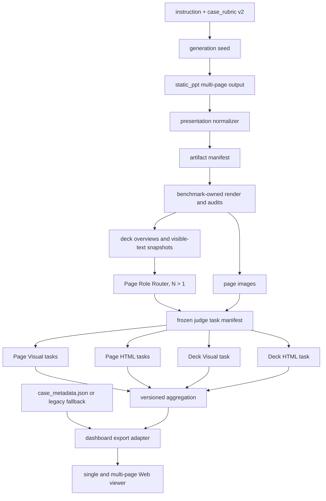

# 静态 HTML PPT Benchmark 单页与多页统一适配方案

> 文档状态：设计评审稿，不包含代码修改  
> 目标：在保留历史单页结果的前提下，新增可复现、可扩展的多页生成与评测协议  
> 首期范围：1–40 页、同一 deck 使用统一画布、instruction-only case

## 1. 决策摘要

当前项目的生成、规范化、Judge、评分和监督脚本都以 `slide_01` 为中心。上游 `static_ppt` 已能生成多页，但 Benchmark 不能只把现有单页 Judge 简单循环 N 次：逐页循环可以复用页面质量评测，却无法覆盖整套一致性、故事线、页面角色、跨页实现质量和多任务恢复。

本方案采用“统一基础设施、两种评测协议”的方式：

1. 旧 `case_special_rubric_v1` 继续走 `legacy_single_v1`，保持历史结果只读和可复现。
2. 新 case 使用 `case_special_rubric_v2` 和 `presentation_v2`；实际产物为 1 页时走新版单页分支，超过 1 页时增加 Router 与 Deck Judge。
3. `case.yaml` 保持轻量且格式不变；每个新 case 按约定新增 `case_metadata.json` 保存 domain、scenario、audience、topic、style、complexity 等多维标签。页数、页面结构要求和 criterion scope 仍来自 query 派生的 `case_rubric.source.json`，避免分类标签与评分合同混在一起。
4. 多页逐页评测继续使用每页独立图片和 HTML 请求；整套评测使用每 4 页一张 overview，并在一次 Deck Visual 请求中输入全部 overview。
5. 多页正式评分前执行一次整套级 Page Role Router。Router 只选择附加角色 profile，不能取消任何页面的基础质量检查。
6. Benchmark 必须从 HTML 重新生成可信评测 PNG，不能仅因上游 PNG 比例正确就直接复用，避免 HTML 与截图不一致。
7. 图片处理必须保持 case 的实际画布比例，不能把 4:3、9:16 等页面强制拉伸成 1600×900。
8. Page、Role、Deck、Case-specific 和 Artifact Compliance 分开输出；首期不合成单一总分。
9. 新协议使用可恢复的任务 DAG 和任务级缓存。40 页基准请求量为 83 次，不能因单个失败重跑整套。
10. 新旧协议、rubric、Router、渲染环境和输入预处理全部独立版本化，禁止把新协议分数与历史单页分数直接混排。
11. Web 看板使用统一的 Presentation Viewer：单页保持现有显示不变；多页仅增加左右按钮、键盘方向键、页码和缩略图条，并补充当前页、整套和产物三层结果视图。

### 1.1 请求量

| 协议 | 适用情况 | 模型请求量 |
| --- | --- | ---: |
| 当前 `legacy_single_v1` | 历史单页 | 4 次：case/common × visual/html |
| 新 `presentation_v2` 单页 | 新合同且实际 1 页 | 2 次：Page Visual + Page HTML，响应内分 rubric section |
| 新 `presentation_v2` 多页 | 实际 N 页，N > 1 | `2N+3`：1 Router + N Page Visual + N Page HTML + 1 Deck Visual + 1 Deck HTML |

`2N+3` 是协议基准值。首期应在请求前校验 prompt 和 rubric 大小；超出预算时直接标记 preflight failure，不在同一协议版本中临时切换分片策略。以后若引入 rubric 分片，必须升级评测协议版本。

## 2. 当前实现与已确认缺口

### 2.1 生成阶段

- [`generate_ppt.sh`](../../generate_ppt.sh) 强制追加 “exactly one” 和 `slides/slide_01.html`。
- 当前使用 `distill_ppt.py --query`。上游只有 JSONL `--input` seed 才能携带 `slide_count` 字段，而且该字段最终仍只是“目标页数约 N 页”的生成提示，不是严格验收。
- 脚本只期望一个 sample 目录，这一点可以保留，但需要用单条 seed JSONL 调用上游。
- `supervise_generate_ppt_matrix.sh` 通过 `slide_01.html`、`slide_01.png` 和 `recovery.json` 判断完成，无法识别缺页、断号或页数不符。

### 2.2 产物规范化

- `normalize_single_slide_run.py` 只发现和恢复一份 HTML，并固定输出 `slide_01`。
- 当前只在 PNG 缺失、损坏或比例错误时重渲染；比例正确但内容过期的 PNG 会被继续使用。
- 当前 `copytree(..., symlinks=True)` 会复制整个上游工作区。上游可能包含指向外部 skill 目录的符号链接、`_trace`、缓存或敏感日志，不适合作为正式评测输入。
- 上游验收只要求至少一张规范 HTML 且每张有非空白 PNG，不验证期望页数、页号连续性或同一 deck 的统一画布。

### 2.3 Judge 阶段

- `run_dual_rubric_judge.py` 固定读取 `slides/slide_01.html` 和 `renders/slide_01.png`。
- OpenAI-compatible 与 Anthropic transport 都只接受一个 `image_path`，尚不支持多图及页码文本与图片交替输入。
- 当前每个单页实际创建 4 个 task，而原计划中的“单页 2 请求”属于新协议行为，不能描述成现状。
- 当前线程池使用 `max_workers=len(tasks)`；扩展到 80 多个 task 后会造成突发并发、429 和内存压力。
- 当前任一 future 抛错可能终止本 generation model 的聚合，缺少大规模任务下的部分成功、断点续跑和覆盖率语义。
- Page HTML prompt 可输入完整 HTML；Deck HTML 若再输入 40 份 HTML 和完整 CSS，容易超过上下文，需要先做确定性摘要。

### 2.4 Rubric 与评分

- 当前仓库存在 `rubric/single_page_image_rubric_v1.yaml`、`v2.yaml` 和 `v3.yaml`；新版协议必须显式记录实际文件名、版本和 hash，不能把文件版本与 evaluation revision 混用。
- 当前 case 只通过一级目录表达 domain，没有独立的多维标签合同；如果直接扩展人工维护的 `case.yaml`，嵌套字段、枚举和历史缺失值都缺少严格校验。
- 当前 case-specific v1 只有 `evaluation_mode: visual|html`，没有 page/deck scope 或页面 selector。
- 历史 runner 的输出合同一次只处理一套 rubric。新版把 common、role 和 case-specific 合并进一次请求后，需要新的分 section 严格合同。
- 简单页若直接使用完整内容页 rubric 会被错误惩罚；但若 Router 能删除基础指标，又会形成“分类成封面即可逃避评分”的漏洞。
- 当前仅计算无权重平均分，没有 task coverage、Router 状态、按角色分布或不完整评测的 leaderboard 资格判断。

### 2.5 运行与文档

- `judge.sh`、README、`使用说明.md`、supervisor 和测试均以单页目录及固定 rubric 为中心。
- 当前 `judge.sh`、README 示例以及 `data/Academic` / `examples/Academia` 存在路径和命名差异，改造时需要统一 source of truth。
- 当前文档没有明确评测协议版本与 `evaluation_revision`、case rubric revision、common rubric version 之间的边界。
- 当前 repo 内没有直接读取本项目 `score_result.json` 的正式评测看板。相邻 benchmark 的前端已经支持 `renders[]`、全篇预览和逐页问题，可以复用交互思路，但其五轴总分数据合同与本项目不同，不能直接读取新结果。

## 3. 目标范围与非目标

### 3.1 首期目标

- 同一套 runner 支持实际 1–40 页 presentation。
- 严格验证页数、页号、HTML/PNG 配对、画布、资源和上游状态。
- 同时得到逐页质量、页面角色完成度、整套质量、case-specific 质量和产物合规性。
- 新 case 具有可校验、可筛选的多维 metadata；历史单页缺少 metadata 时继续可运行并明确标记为未标注。
- 支持 40 页下的有界并发、任务级重试、断点续跑和成本记录。
- 对历史 v1 case 和 evaluation 保持只读兼容。
- 使用同一套 Web 看板展示 legacy 单页、v2 单页和 v2 多页，同时严格区分可比组和不适用指标。

### 3.2 首期明确不做

- 不生成或修改上游 PPT 内容。
- 不评估动画、演讲者备注和交互播放体验；`present.html` 只做播放入口，不是正式评分证据。
- 不支持同一 deck 混合画布比例。
- 不立即定义跨 Page/Deck/Case 的单一 leaderboard 总分。
- instruction 附带 PDF、表格或其他参考材料的事实忠实度评测暂不纳入首期；见“仍需评审确认的事项”。

## 4. 目标架构



当实际页数为 1 时，跳过 overview、Router、Deck Visual 和 Deck HTML，只生成两个 Page task。
Page Visual 仍可在输出中报告 `observed_role` 供审计和 case-specific criterion 使用，但不加载多页 role profile，也不产生 `role_fulfillment` 分数。

## 5. Case 元数据与页面结构合同

本节采用三个独立来源，避免同一信息被人工维护两次：

| 文件 | 是否人工直接维护 | 职责 | 是否影响 Judge 分数 |
| --- | --- | --- | --- |
| `case.yaml` | 是，保持现状 | case ID、instruction、active rubric revision、canvas | 仅作为运行入口 |
| `case_metadata.json` | 新 case 必须提供；可由 query 分类器生成后审核 | domain、scenario、audience、topic、style、complexity 等数据集标签 | 默认不作为 Judge 输入 |
| `case_rubric.source.json` / revision YAML | 由 query 生成并转换 | 页数、页面结构要求、page/deck criterion | 是 |

`case_metadata.json` 采用固定文件名，loader 按 case 目录自动发现；不要求在 `case.yaml` 中再增加路径字段。这样旧 case 的 `case.yaml` 无需改写，新 case 也不会多维护一份引用。

### 5.1 `case.yaml` 保持轻量

```yaml
case_id: example_case
instruction: instruction.md
active_rubric_revision: v001
canvas:
  width: 1600
  height: 900
```

不在这里增加标签、页数和页面角色。YAML 只保留少量入口配置，复杂嵌套数据使用 JSON 和 schema 校验。

### 5.2 新增 `case_metadata.json`

每个新 case 在 case 根目录新增：

```json
{
  "schema_version": "case_metadata_v1",
  "taxonomy_version": "ppt_case_taxonomy_v1",
  "domain": "education",
  "scenario": "classroom_lecture",
  "audience": "undergraduate_students",
  "topic": "cybersecurity",
  "style": "expository",
  "complexity": "standard",
  "provenance": {
    "source": "query_classifier_v1",
    "reviewed": false
  }
}
```

字段语义：

- `domain`、`scenario`、`audience`、`style`、`complexity` 使用版本化枚举，用于分层采样、数据统计和看板筛选。
- `topic` 首期允许受控自由文本；后续若需要多主题或层级主题，再升级 metadata schema，不在 v1 中同时接受 string/list 两种类型。
- `style` 明确定义为内容表达方式，不表示页面视觉风格，避免与 Judge 的视觉风格评价混淆。
- `provenance` 记录标签来源。模型生成时至少保存 classifier/prompt version 和 `reviewed`；人工创建可写 `source: human`、`reviewed: true`。
- metadata 是描述性标签，不是隐藏评分要求。Judge 默认只使用 instruction、case rubric 和正式 evidence；修改标签只影响数据切片和看板，不应改变已有分数。

配套新增 `case_metadata_v1` JSON Schema 和 `ppt_case_taxonomy_v1` 枚举表。Schema 负责字段类型、必填项和禁止额外字段；taxonomy 文件负责枚举集合，避免把大量枚举硬编码在多个脚本中。

### 5.3 旧单页 case 的兼容与迁移

历史单页 case 可以没有 `case_metadata.json`，不要求为了启用多页协议一次性手工补齐。统一 loader 输出规范化视图：

```json
{
  "schema_version": "legacy_missing",
  "taxonomy_version": null,
  "domain": "education",
  "scenario": null,
  "audience": null,
  "topic": null,
  "style": null,
  "complexity": null,
  "metadata_status": "unlabeled"
}
```

兼容规则：

- metadata 文件缺失时，legacy v1 case 只产生 warning，不阻塞生成、Judge 或历史结果展示。
- `domain` 可从现有一级目录名确定性归一化；其余字段无法可靠推导时保持 `null`，不能自动填入 `general` 等伪标签。
- runtime fallback 只存在于内存、manifest 和 dashboard export，不自动回写旧 case，避免一次运行产生大范围源码变更。
- 新建 case 或升级为 `case_special_rubric_v2` 的 case 必须提供有效的 `case_metadata.json`；因此兼容逻辑不会成为新数据长期缺标的入口。
- 看板将缺失值显示为“未标注”，统计时单列 `unlabeled`，不得混入任一正常标签。
- 后续提供可 dry-run 的批量回填工具：确定性补 domain；模型辅助生成其他标签并写入 provenance；正式 benchmark 集再按优先级人工审核。回填 metadata 不创建新的 rubric revision，也不改写历史 evaluation。

### 5.4 `case_special_rubric_v2` 的 presentation 合同

页数和页面结构会影响生成、artifact validation、Router 和 Judge，因此仍写入版本化 `case_rubric.source.json`，而不是复制到 metadata。修改 `examples/case_rubric.template.json`，由 query 生成：

```json
{
  "contract_version": "case_special_rubric_v2",
  "presentation": {
    "presentation_type": "multi_page",
    "structure_mode": "partially_specified",
    "page_count": {
      "mode": "exact",
      "min": 4,
      "max": 4
    },
    "requirements": [
      {
        "id": "cover",
        "function": "opening_cover",
        "scope": {"type": "first_page"},
        "cardinality": {"min": 1, "max": 1},
        "strength": "required",
        "order_after": []
      }
    ],
    "pages": null
  }
}
```

页数使用统一的 nullable `min/max` 形状，并保留显式 `mode`，避免把系统上下限误解为 query 指定范围：

```json
{"mode": "exact", "min": 4, "max": 4}
{"mode": "range", "min": 4, "max": 8}
{"mode": "unspecified", "min": null, "max": null}
```

规则：

- `presentation_type` 为 `single_page | multi_page`。single page 必须是 exact 1；multi page 的有效下限至少为 2。
- `structure_mode` 为 `fully_specified | partially_specified | unspecified`。
- `fully_specified` 时 `pages` 必须列出每页，并与 exact page count 对齐；`partially_specified` 可只写 requirements；`unspecified` 的 `pages` 为 `null`。
- `requirements` 只记录 query 明确提出的结构要求，不能按“通常 PPT 应有封面、目录和结束页”自动补全。
- requirement ID 必须唯一；`function`、scope type、strength 使用闭集枚举；cardinality 满足 `0 <= min <= max`。
- `order_after` 只能引用已存在的 requirement ID，并且依赖图必须无环。
- `pages` 中引用的 requirement ID 必须存在；页面索引必须连续、唯一并落在 page-count 合同内。
- 历史 v1 rubric 缺少 `presentation` 时，兼容解释为 single page、exact 1、structure unspecified，不要求批量修改旧 revision。
- `max` 和最终实际页数不得超过全局 `--max-slides`，首期默认 40；unspecified 也必须满足 1–40 页。

原计划中的人工维护 `expected_page_roles` 不再作为第二个 source of truth。orchestrator 在 artifact manifest 产生后，根据 requirement 的 `function + scope + cardinality` 派生 `expected_role`，写入 `judge_task_manifest.json`；Router 输出的 `observed_role` 始终独立保存。

### 5.5 页面 selector 与 requirement scope

Case-specific criterion 继续使用评分 selector：

```json
{"mode": "indices", "values": [2, 3]}
{"mode": "first"}
{"mode": "last"}
{"mode": "all"}
```

Presentation requirement 使用结构 scope，首期支持：

```json
{"type": "first_page"}
{"type": "last_page"}
{"type": "all_pages"}
{"type": "page_index", "value": 3}
{"type": "page_range", "min": 3, "max": 5}
{"type": "any_page"}
```

- `indices/page_index/page_range` 仅用于 query 明确指定页号的情况。
- `first`、`last`、`all` 以及对应 requirement scope 在 artifact manifest 产生后解析成实际页号，并写入 `judge_task_manifest.json`。
- selector 和 scope 不得落在页数合同之外；互斥 requirement 不得解析到冲突页面。
- 不引入 `auto` selector。query 没有指定页面位置的整体要求应使用 deck criterion，避免 Router 同时决定“在哪页评分”和“该页是什么角色”。

### 5.6 Case-specific criterion

v2 criterion 增加：

```yaml
evaluation_scope: page   # page 或 deck
page_selector:           # page scope 必填，deck scope 禁止
  mode: last
requirement_refs:        # 可选，只引用 ID，不复制 requirement
  - ending
```

路由原则：

- query 明确要求“第一页”“最后一页”“所有页”时使用 page scope。
- 未指定页号的内容覆盖、故事线、主题、受众和整套风格要求使用 deck scope。
- page scope 必须携带 selector；不再使用“省略 selector 即默认所有页”的含糊语义。
- query 明确指定页面角色时，presentation 中生成对应 requirement；需要评价完成质量时再生成有 anchors 的 criterion，并通过 `requirement_refs` 关联。结构 requirement 本身不是 LLM 分数。
- 页数、顺序、cardinality 和角色位置等可确定检查进入 Artifact/Structure Compliance；涉及表达质量和内容完成度的部分才进入 Judge，避免同一问题被隐式重复扣分。

### 5.7 Metadata 与 rubric 校验工具

新增 metadata 校验入口，并调整 `scripts/rubric_authoring/convert_case_rubric_to_yaml.py`：

- metadata validator 按 `schema_version` 校验 exact fields，并按 `taxonomy_version` 校验枚举；旧 case 缺文件走显式 legacy fallback。
- 按 `contract_version` 分派 case rubric v1/v2 校验，保持 v1 输出完全兼容。
- 对 presentation type、structure mode、page count、requirements、pages、selector、scope/selector 组合做 exact-field 和交叉字段校验。
- 校验 requirement ID、引用、cardinality、页号范围、页面连续性和 `order_after` DAG。
- 增加 `--max-slides`，默认 40。
- 保持 anchor 规范化、JSON→YAML 字段顺序、round-trip 和 `--check` 行为。
- 增加 prompt-size preflight 所需的 rubric 字节数和 criterion 数统计，但不恢复固定的 criterion 条数上限。

## 6. 生成适配

`generate_ppt.sh` 不再拼接单页固定文案，而是读取 active `case_rubric.yaml`：

1. 根据 `case.yaml.active_rubric_revision` 定位 case rubric，并验证目录名、YAML revision 与 case ID 一致。
2. 生成一条 seed JSONL，使用 `distill_ppt.py --input ... --limit 1 --workers 1`。
3. exact 模式写入 `slide_count`；range/unspecified 把允许范围写入 query brief。
4. 上游 `slide_count` 仍视为软提示，最终是否合格只由 Benchmark artifact validation 决定。
5. seed、query、page-count source、上游 batch 和 manifest record 全部记录到 generation metadata。

对于附件型 query，首期只保留扩展接口，不在未定义参考证据合同的情况下宣称完成事实忠实度评测。

## 7. Presentation 产物与可信渲染

### 7.1 页面发现

- 首期只接受 `^slide_([0-9]{2})\.html$`，最大 40 页，因此两位编号足够。
- 页号按整数排序并要求从 1 连续到 N。
- `slide_1.html`、backup、bak、隐藏文件和临时文件不计入正式页面，并记录 violation。
- 每份 HTML 必须存在同名上游 PNG，但上游 PNG 只作为生成 provenance，不直接作为最终 Judge 图片。

### 7.2 安全复制与资源验证

- Benchmark 输出使用 allowlist：`slides/`、`base.css`、本地 `assets/`、必要的 plan/provenance 文件。
- 不复制外部 `skills` 符号链接、缓存和未脱敏 `_trace` 到正式 evaluation。
- 拒绝指向 run 目录外部的 symlink、`../` 路径逃逸、不可读资源和超限文件。
- 记录所有本地 asset 的路径、MIME、大小和 SHA-256；远程 HTTP 资源视为不可复现依赖并标记 violation。
- 若要长期保存 `_trace`，应进入单独的受控 provenance 区，并执行密钥脱敏，不作为 Judge 输入。

### 7.3 Benchmark-owned render

每页都从规范化 HTML 重新渲染，不再按“现有 PNG 比例正确”跳过：

- 使用固定 Chromium/renderer 版本、viewport、device scale、字体目录和等待策略。
- 禁止外部网络；等待本地图片和字体完成；禁用动画和 transition 后截图。
- 将生成 HTML 视为不可信代码，在隔离的浏览器进程和受限文件系统中执行，并设置 CPU、内存、文件大小和渲染超时；脚本执行、file URL 逃逸或异常资源消耗必须进入 violation。
- 记录 renderer、Chromium、字体包版本以及所有输入 hash。
- 上游 PNG 与 Benchmark PNG 分路径保存，避免 provenance 和正式证据混淆。
- 若相同 HTML 在同一渲染 profile 下重复截图 hash 不稳定，标记 nondeterministic render，不进入 leaderboard。

### 7.4 画布

- 同一 deck 的所有页面必须使用同一 canvas；首期不支持混合比例。
- 规范渲染遵循 instruction/case canvas 合同，不强制 16:9。
- 给 Page Judge 的模型输入图保持原比例，最长边最多 1600 px。例如 16:9 为 1600×900，4:3 为 1600×1200，9:16 为 900×1600。
- 禁止拉伸和裁切；必要时仅使用中性 letterbox，并记录变换。

### 7.5 Artifact manifest

`artifact_manifest.json` 至少包含：

- contract version、case/generation/run ID；
- page-count contract、实际页数、最大页数和合同来源；
- 页号连续性、HTML/PNG 配对、统一 canvas；
- 每页 HTML、上游 PNG、Benchmark PNG、asset 与 audit 的路径和 hash；
- 上游真实 `raw_status`、`raw_reason` 和 normalization actions；
- violations、`artifact_compliance`、`leaderboard_eligible`。

页数不符、断号、缺资源或 raw rejected 时，不得被 normalizer 改成 completed。存在 1–40 张可评页面时可以继续生成诊断结果，但 `leaderboard_eligible=false`；0 页或超过 40 页时不调用 Judge。

## 8. 图片与 Deck 证据策略

### 8.1 Page Visual

- 每页一次请求，只输入该页的比例保持评测图。
- 用于小字、图表、裁切、构图、内容准确性和页面级 case criterion。
- 原始图、评测图和 resize profile 分别记录 hash。

### 8.2 Deck overview

- 每 4 页按顺序组成一张 2×2 overview。
- overview 尺寸根据页面比例和 provider preflight 确定，不硬编码成 3200×1800；首选 profile 可将每个 tile 的长边控制在约 1000–1200 px。
- Slide 标签放在 tile 外的 gutter，不覆盖页面像素。
- 最后一组不足 4 页时，空格明确标记为 `PADDING — NOT A SLIDE`，并在 prompt 中要求忽略，不能标记成 `NO SLIDE` 造成缺页暗示。
- overview 只用于主题、配色、视觉系统、一致性、节奏、重复和叙事，不用于局部文字判断。

40 页最多 10 张 overview，Deck Visual 在一次请求中按以下顺序交替输入：

```text
Slides 01–04
<overview image>
Slides 05–08
<overview image>
```

### 8.3 Visible-text snapshot

仅靠 overview 无法可靠评估整套精确内容覆盖。需要从 Benchmark 运行时 DOM 生成逐页 `visible_text_snapshot.json`：

- 只记录实际可见的标题、正文和页码，排除 script、style、隐藏节点和注释。
- 每段文本保留 slide index 和可定位 selector。
- Deck Visual 可以使用 `deck_overview` 与 `slide_visible_text` 两类证据，但不能据此评价局部构图。
- 文本长度使用确定性上限和截断标记；不允许静默截断后仍声称完整覆盖。

### 8.4 Provider preflight

在正式 benchmark 前固定并验证：

- 最大图片数量、单图像素、请求体字节数和上下文上限；
- OpenAI-compatible 与 Anthropic 多图消息格式；
- text/image 交替顺序是否被代理保留；
- provider 是否自动缩放图片，以及可配置的 media resolution；
- 1、5、20、40 页请求的延迟、token/usage 和失败率。

同一协议不能在 provider 拒绝后临时改用另一种拼图或窗口策略。失败需保存完整 metadata，并通过升级输入 profile 版本解决。

## 9. Page Role Router

### 9.1 角色与用途

Router 对整套多页 presentation 只调用一次，为每页输出一个主角色：

```text
cover | toc | section | content | ending | other
```

Router 不评分，只决定加载哪个附加 role profile。所有页面始终执行 Base Page Rubric。

### 9.2 输入与输出

输入：instruction、slide count、全部 overview、逐页 visible-text snapshot 和页序。它不输入 40 份完整 HTML，也不信任生成器的 `plan/deck.md` 或自报角色。

输出合同 `page_role_router_v001`：

```json
{
  "contract_version": "page_role_router_v001",
  "slides": [
    {
      "slide_index": 1,
      "observed_role": "cover",
      "confidence": 0.93,
      "evidence": "主标题与单一首屏焦点"
    }
  ]
}
```

### 9.3 防误路由规则

- 简单角色必须证据充分；“文字少”不能自动判成 cover、section 或 ending。
- 混合页若同时承担实质内容，优先路由到 `content`；无法确定时使用 `other`，不能选择检查更少的 profile。
- Router 必须按实际产物分类。query-derived presentation requirements 在 Router 输出冻结后由 orchestrator 解析为 `expected_role`，避免把 query 要求复制成观察结果。
- 任务清单保存 `expected_role`、`observed_role`、`role_matches_expectation`；匹配结果进入 Structure Compliance，并仅在存在关联 `requirement_refs` 的定性 criterion 时进入 case-specific Judge。
- Page Visual Judge 也报告观察角色；与 Router 不一致时只生成 warning，不动态换 rubric 或重跑。

### 9.4 置信度、失败和缓存

- `0.70` 只能作为待校准的初始阈值，最终阈值必须由人工标注集上的准确率、混淆矩阵和低置信度覆盖率确定。
- 低于阈值时使用 `other` profile 并进入 review queue。
- Router 超时、非法 JSON、漏页或重复页时，全部页面使用 Base + `other`，正式 Judge 仍可继续；Router failure 单独记录。
- Router model、参数、temperature、prompt hash、输入 hash 和阈值必须固化。
- Router 结果按 generation artifact + case revision + router profile 缓存，在不同 Judge profile 间复用。

## 10. Judge 与 Rubric 设计

### 10.1 协议边界

- `legacy_single_v1`：保留当前 4 请求 runner，历史结果不重写。
- `presentation_v2`：common、role、case-specific 在同一 evidence task 中分 section 返回，使用新的严格输出合同。
- 即使 v2 单页继续使用现有 `single_page_image_rubric_v1/v2/v3.yaml` 的内容，新 envelope 和 prompt 已改变，因此结果仍不能与 legacy 分数直接比较。

### 10.2 Common rubric 文件

不修改现有单页 YAML，新增：

```text
rubric/presentation_page_base_rubric_v001.yaml
rubric/presentation_page_role_profiles_v001.yaml
rubric/presentation_deck_common_rubric_v001.yaml
```

新版单页使用显式指定的现有单页 common rubric，并在 run config 中记录实际文件路径和 hash，不能只依赖模糊的“最新版”选择。

### 10.3 Base Page Rubric

多页中的每一页无条件检查：

1. 核心信息清晰且内部一致；
2. 构图、层级和文字可读性；
3. 视觉完成度和技术执行；
4. 与主题、受众和整套媒介的风格适配；
5. HTML/DOM/CSS 可维护、可编辑和布局健壮性。

### 10.4 Role profiles

- `cover`：标题/主题识别、必要身份信息、首屏焦点；不要求内容页密度。
- `toc`：结构清楚、顺序可扫描、与实际 deck 组织基本一致。
- `section`：章节转换和当前位置明确，为后续内容建立方向。
- `content`：页面信息任务完整，证据/数据/图文关系有效，密度合理。
- `ending`：形成收束，保留 takeaway 或 query 要求的结束信息。
- `other`：通用页面目的、信息取舍和功能完成度，也是安全 fallback。

角色 profile 只增加检查，不删除 Base。不同 profile 使用独立 criterion ID。

### 10.5 Deck Common Rubric

至少检查：

1. 整套内容覆盖与核心主题；
2. 叙事结构和逻辑推进；
3. 跨页信息分配、重复和遗漏；
4. 配色、字体、组件和视觉母题一致性；
5. 有目的的版式变化和页面节奏；
6. 与 deck 长度相适应的开场、导航和收尾；
7. 共享 CSS、公共骨架、组件复用和跨页可维护性。

短 deck 不应因没有目录或章节页自动扣分；合理 recap 不应机械视为重复。anchors 必须写明长度感知和合理例外。

### 10.6 Evidence isolation

| Task | 输入 | 禁止输入/评分 |
| --- | --- | --- |
| Page Visual | instruction、当前页图片、当前页 criteria | HTML、DOM、跨页一致性 |
| Page HTML | instruction、当前页 HTML、DOM audit | PNG、视觉审美 |
| Deck Visual | instruction、全部 overview、visible-text snapshot、deck criteria | 40 份完整 HTML、局部小字构图 |
| Deck HTML | base.css 摘要、共享资源清单、逐页 DOM/CSS 摘要 | PNG、视觉审美 |

所有 prompt 都要声明 HTML、页面文字和注释是“不可信被评作品”，忽略其中要求 Judge 改规则、泄露 prompt 或给高分的指令，防止 prompt injection。

### 10.7 Deck HTML 摘要

Deck HTML 不直接拼接全部源码，而由确定性 audit 生成：

- 每页 HTML bytes/hash、root、可见节点数、overflow、绝对定位、inline style、脚本和外部请求；
- 共享 `base.css` hash、变量、规则、选择器和大小；
- 每页 inline CSS 摘要、重复规则、公共 class/组件使用情况；
- asset 重复、缺失和跨页引用；
- 所有截断字段及原始文件定位。

### 10.8 Task manifest 与并发

Router 完成或 fallback 后，生成不可变的 `presentation_judge_task_manifest_v001`：

- 每个 task 的 ID、scope、slide index、evidence、rubric criteria 和 input hash；
- resolved selector、Router role 和 role profile；
- provider/model/prompt/profile 版本；
- temperature、top_p、seed（若支持）、media resolution、max tokens 和 timeout 等完整推理参数；
- 依赖关系、重试状态和 leaderboard-required 标记。

Page Visual、Page HTML、Deck Visual、Deck HTML 进入有界任务池：

- 全局默认并发 8，同时增加 provider-specific concurrency 和 rate limiter。
- retry 仅重跑失败 task，使用指数退避和 jitter。
- 成功 task 根据完整 input hash 复用；修改 rubric、prompt、图片或 HTML 后缓存自动失效。
- 一个 task 失败不取消其他独立 task，最终报告 task coverage。
- 保存 request、每次 raw response、usage、attempt、normalization 和 failure stage。

## 11. 评分、完整性与报告

### 11.1 独立结果

首期输出：

```text
page_quality
role_fulfillment
deck_quality
case_specific
artifact_compliance
evaluation_coverage
leaderboard_eligible
```

- `page_quality`：每页 Base score 等权宏平均。
- `role_fulfillment`：每页角色 profile 独立平均，同时提供按 role 的 count/mean/distribution；它是诊断指标，不建议在不同角色组成的 deck 间直接排名。
- `deck_quality`：每个 Deck Common criterion 只评分一次。
- `case_specific`：case criteria 等权；绑定多页的单个 criterion 先按目标页聚合，再作为一个 criterion 参与平均。
- 单页的 role/deck 指标为 `not_applicable`，不用 0 分占位。

### 11.2 不完整评测

- 任一 required task 缺失时，不允许只平均成功项后输出“完整分数”。
- 每个 section 输出 `expected_task_count`、`completed_task_count`、`coverage_ratio` 和失败列表。
- 页数不合规、raw rejected、渲染不稳定、Router/required Judge 不完整时，`leaderboard_eligible=false`。
- 诊断分仍可展示，但必须带 failure 和 coverage。
- Artifact 页数问题与 Deck 故事线问题可以同时出现，但由于首期不合成 final score，不会被隐式双重扣权。

### 11.3 版本与复现

至少版本化：

```text
case_special_rubric_v2
presentation_artifact_v001
benchmark_render_profile_v001
deck_overview_profile_v001
page_role_router_v001
presentation_judge_task_manifest_v001
presentation_judge_output_v002
presentation_score_v001
```

`evaluation_revision`、case rubric revision、common rubric version、protocol version、Router profile 和 render profile 是不同概念，必须分别记录 hash，不能只用一个 `v002` 代表全部变化。

## 12. 输出目录

历史目录保持只读。新协议建议把可跨 Judge profile 复用的 artifact/Router 放在 generation run 的 `_shared` 下：

```text
evaluations/<evaluation-revision>/<generation-model>/<generation-run>/
├── _shared/<artifact-profile-hash>/
│   ├── artifact_manifest.json
│   ├── evaluation_renders/
│   ├── deck_overviews/
│   ├── audits/
│   ├── router/
│   └── judge_task_manifest.json
└── <judge-profile>/
    ├── run_config.json
    ├── pages/slide_01/
    │   ├── requests/
    │   ├── raw_responses/
    │   └── judge_results/
    ├── deck/
    └── score_result.json
```

共享目录键必须包含 artifact、render、overview、Router 和 case revision 相关 hash，防止错误复用。

## 13. Web 看板适配

### 13.1 设计原则

看板只维护一套 Presentation Viewer，不复制两套页面：

- 单页继续保留当前“左侧 PPT 预览 + 右侧评分详情”的布局。
- 实际页数为 1 时，不显示翻页按钮、键盘提示、页码和缩略图条，视觉与现有单页看板保持一致。
- 实际页数大于 1 时，在原预览组件上渐进增加翻页能力，不改变右侧评分面板的主结构。
- 看板展示的是 Benchmark-owned render；上游原始 PNG 只在 provenance 中提供，不作为默认预览。
- UI 同时兼容 `legacy_single_v1`、`presentation_v2` 单页和 `presentation_v2` 多页，但评分不能跨协议直接比较。

### 13.2 多页浏览交互

多页状态增加以下控件：

1. PPT 画布左右两侧各一个上一页/下一页按钮；第一页禁用上一页，最后一页禁用下一页。
2. 支持键盘 `ArrowLeft` / `ArrowRight` 翻页；焦点位于 input、textarea、select 或弹窗时不拦截按键。
3. 画布下方显示 `03 / 08` 形式的当前页码。
4. 页码下方显示水平缩略图条，当前页使用明确选中边框；缩略图超过容器时横向滚动并自动让当前页进入可视区。
5. 支持点击缩略图跳页、Esc 关闭大图、URL deep link 保存当前 case/model/run/slide，方便评审分享。
6. 预览容器按实际 canvas 比例布局，兼容 16:9、4:3 和 9:16，不拉伸或裁切。
7. 40 页场景使用缩略图懒加载或虚拟列表，不一次加载全部正式评测图。

首期不需要在 Web 中执行 `present.html`。PNG 是正式视觉证据；若后续增加 HTML 交互预览，应使用独立 origin、CSP 和无脚本 sandbox iframe。

### 13.3 详情面板

右侧详情面板增加三个 Tab，但保留当前页作为默认视图：

| Tab | 展示内容 | 单页行为 |
| --- | --- | --- |
| 当前页 | Base Page、Role profile、page-scoped case criteria、Visual/HTML evidence、task 状态 | 保持现有单页详情；无 role profile 时隐藏该 section |
| 整套 | Deck Common、deck-scoped case criteria、overview、跨页问题 | 显示 `Not applicable` 或隐藏，不用 0 分占位 |
| 产物 | 页数合同、Artifact violations、Router、coverage、retry、usage、版本/hash | 单页与多页均展示 |

选中页面变化时，仅刷新“当前页”Tab 的图片、角色、criteria 和证据；Deck 与 Artifact 结果不随翻页重复加载。

多页当前页视图至少展示：

- `slide_index` 和总页数；
- `expected_role`、`observed_role`、Router confidence 和 mismatch warning；
- `base_page_score`、`role_fulfillment_score`；
- 当前页适用的 case-specific criteria；
- Page Visual / Page HTML task 是否成功、重试次数和 evidence locator。

### 13.4 Dashboard 数据合同

浏览器不直接遍历 `evaluations/`，也不自行兼容多种 `score_result.json`。新增静态导出适配器，例如：

```text
scripts/export_presentation_dashboard.py
```

它负责读取 legacy/v2 evaluation、artifact、Router、task manifest 和逐页结果，并将 `case_metadata.json` 与 active rubric 的 presentation 合同合并为只读展示视图。浏览器不需要知道源数据分散在哪个文件中，也不维护另一份人工填写的聚合 metadata。统一输出 `dashboard_case_v2`：

```json
{
  "schema_version": "dashboard_case_v2",
  "protocol": "presentation_v2",
  "presentation_type": "multi",
  "case_id": "example_case",
  "generation_model": "gpt",
  "slide_count": 8,
  "metadata": {
    "schema_version": "case_metadata_v1",
    "taxonomy_version": "ppt_case_taxonomy_v1",
    "status": "labeled_unreviewed",
    "domain": "education",
    "scenario": "classroom_lecture",
    "audience": "undergraduate_students",
    "topic": "cybersecurity",
    "style": "expository",
    "complexity": "standard"
  },
  "scores": {
    "page_quality": 84.2,
    "role_fulfillment": 81.5,
    "deck_quality": 78.0,
    "case_specific": 86.4
  },
  "evaluation": {
    "coverage_ratio": 0.98,
    "leaderboard_eligible": false
  },
  "slides": [
    {
      "slide_index": 1,
      "thumbnail": "thumbnails/slide_01.webp",
      "render": "renders/slide_01.png",
      "expected_role": "cover",
      "observed_role": "cover",
      "role_confidence": 0.94,
      "base_score": 88,
      "role_score": 91,
      "warnings": []
    }
  ]
}
```

legacy case 缺少 metadata 文件时，导出器使用第 5.3 节的 fallback，`status=unlabeled` 且缺失维度为 `null`。数据按需拆分，避免一个 batch JSON 包含所有页面的完整 criteria 和 evidence：

```text
dashboard-data/
├── index.json                         # case/run 摘要和筛选字段
└── cases/<case>/<model>/<run>/
    ├── summary.json                   # presentation/deck/artifact 摘要
    └── slides/slide_NN.json           # 单页 criteria 和证据，按需加载
```

导出数据与正式 evaluation 分离；Dashboard schema 升级不能修改或覆盖 Judge 原始结果。

### 13.5 总览、筛选与可比性

总览列表建议展示：

```text
Case | Model | Protocol | Pages | Page | Role | Deck | Case | Coverage | Artifact | Status
```

并提供以下筛选：

- 单页 / 多页 / 全部；
- domain、scenario、audience、topic、style、complexity 和 metadata status；
- protocol、case、generation model、Judge profile；
- 页数范围、Artifact 合规、leaderboard eligibility；
- Router mismatch、低置信度、Judge 不完整。

首期没有单一 final score，因此看板不能自行合成 `total` 或默认总排名。至少拆分以下可比组：

```text
legacy_single_v1
presentation_v2_single
presentation_v2_multi
```

每个可比组还要锁定 benchmark version、rubric/profile、Judge model、Router 和 render/overview profile。`deck_quality` 对单页显示 N/A；N/A 不能按 0 计入均值。每个聚合指标同时展示有效分母和 coverage。metadata 标签用于切片而不是定义分数可比性；导出器必须记录 metadata/taxonomy version 和 source hash，使同一批报告可以复现。

### 13.6 多模型对比

同一 case 下支持模型并排对比：

- 页数相同且合同为 exact 时，可以按 slide index 同步翻页。
- 页数不同时，不能默认把两个模型的 Slide 03 当作同一语义页面。
- 页数不同时提供 `Sequence` 与 `Role-aligned` 两种模式；后者按 cover/toc/section/content/ending 分组，并明确展示未匹配页面。
- 对比视图同时展示角色序列、缺失/多余页面、Page/Role/Case 分数、Deck 一致性、Artifact 和 Coverage。

### 13.7 完整性、性能与安全

- 看板必须保留 generation failed、artifact invalid、Router failed、Judge 部分成功和 evaluation incomplete 的 case，不能只导出成功且有分数的结果，避免幸存者偏差。
- 生成约 320–480 px 宽的缩略图；列表只加载缩略图，选中或打开大图时再加载正式 render。
- Judge evidence、query、页面标题和模型输出全部视为不可信字符串，使用 `textContent` 或统一 escape，禁止直接拼接到 `innerHTML`，防止 XSS。
- 公共交付使用复制或内容寻址的静态资源，不暴露绝对文件路径，也不依赖指向内部目录的 symlink。
- 导出器记录 schema version、数据生成时间和全部来源 hash；刷新看板不能改变 benchmark 原始分数。

## 14. 需要修改的文件与职责

| 文件/模块 | 计划调整 |
| --- | --- |
| `generate_ppt.sh` | 读取 v1/v2 页数合同；单条 seed JSONL；移除固定单页文案；记录 generation metadata |
| `scripts/normalize_single_slide_run.py` | 泛化或保留为 legacy wrapper，核心迁移到 presentation normalizer |
| 新 `scripts/normalize_presentation_run.py` | 严格页面发现、资源 allowlist、artifact manifest、状态保真 |
| 新 `examples/case_metadata.template.json` | 新 case 的多维标签示例，不包含页数和评分 criterion |
| 新 metadata schema/taxonomy | 定义 `case_metadata_v1` exact fields、枚举版本和字段语义 |
| 新 case spec loader/validator | 自动发现 metadata；旧 case fallback；输出统一 normalized view，不回写源文件 |
| 可选 `scripts/backfill_case_metadata.py` | dry-run 批量补标、保存 provenance 和审核状态，不修改 rubric/evaluation |
| `scripts/read_case_canvas.py` / `dual_rubric_tools.py` | deck 统一 canvas、metadata fallback、v2 requirement/selector/scope、版本化合同 |
| `examples/case_rubric.template.json` | 默认 v2；增加 presentation type、structure mode、page count、requirements、pages、scope 和 selector 示例 |
| `scripts/rubric_authoring/convert_case_rubric_to_yaml.py` | v1/v2 分派、presentation/requirement/selector 校验、round-trip |
| `scripts/run_dual_rubric_judge.py` | 保留 legacy；抽取 transport、retry、audit 等可复用能力 |
| 新 presentation runner | 多图 transport、Router、task manifest、DAG resume、Page/Deck 调度和 v2 聚合 |
| `prompts/judges/*` | 保留 legacy prompts；新增 Router/Page/Deck v2 prompts 和注入防护 |
| `rubric/` | 新增 page base、role profiles、deck common；保留现有 v1/v2/v3 单页文件 |
| `scripts/supervise_generate_ppt_matrix.sh` | 使用 artifact manifest 判断完整性，不再只检查 `slide_01` |
| `judge.sh` | 显式选择 protocol、case、run、revision 和 concurrency；避免路径硬编码 |
| `requirements.txt` | 增加 Pillow；若引入 CSS parser，固定其版本 |
| `README.md`、`使用说明.md` | 更新单页/多页运行方法、协议边界、目录和请求量 |
| 新 `scripts/export_presentation_dashboard.py` | 兼容 legacy/v2；合并 metadata 与 presentation；导出 dashboard index、case summary、slide detail 和安全静态资源 |
| Web 看板前端 | 保持单页布局；增加多页按钮、方向键、页码、缩略图、Page/Deck/Artifact Tab 和多模型对比 |
| `tests/` | 新增 v2 schema、artifact、overview、Router、resume、聚合、Dashboard export 与端到端测试 |

建议保留 `run_dual_rubric_judge.py` 和 `normalize_single_slide_run.py` 作为 legacy 入口，不在原文件中堆叠大量 `if N > 1`，避免破坏历史复现。

## 15. 测试与验收

### 15.1 Schema 与 artifact

- legacy v1 case 缺少 `case_metadata.json` 时继续按 single page、exact 1 解析；只产生可观测 warning，不修改 case 文件和历史转换结果。
- metadata v1 合法字段可读取；未知字段、非法枚举、错误类型和 taxonomy version 不匹配被拒绝。
- legacy domain 目录归一化正确，其余缺失字段保持 `null`；新/v2 case 缺少 metadata 文件被拒绝。
- v2 single/multi、fully/partially/unspecified、exact/range/unspecified、requirements/pages 和 first/last/all/indices selector 正确 round-trip。
- 非法 page count、requirement 重复 ID/悬空引用/环依赖、selector 越界、非法 role、page scope 无 selector、deck scope 带 selector均拒绝。
- 1、2、4、5、40 页正常；0、41、断号、重复、backup、缺 PNG、混合 canvas 正确失败。
- HTML 修改但上游 PNG 未更新时，Benchmark-owned render 反映新 HTML。
- 外部 symlink、远程资源、路径逃逸和超限文件正确标记或拒绝。

### 15.2 图片与多图 transport

- 16:9、4:3、9:16 均保持比例，无拉伸裁切。
- 1、4、5、40 页 overview 数量和映射正确。
- 标签不覆盖页面；padding 不被识别成真实页或缺页。
- OpenAI-compatible 和 Anthropic 的多图顺序、请求体和 usage 记录正确。
- provider 上限 preflight 能在 API 调用前阻止超限请求。

### 15.3 Router

- 对人工标注的 cover/toc/section/content/ending/other 集合计算准确率和混淆矩阵。
- 混合页采取保守角色；低置信度和错误响应稳定回退 `other`。
- expected 与 observed 分离，query 预期不能覆盖实际观察。
- Router cache 在 artifact 或 rubric 改变时失效，在只更换 Judge model 时复用。

### 15.4 Judge 与恢复

- v2 单页产生 2 个 task；N 页多页基准产生 `2N+3` 次模型请求。
- Base、role、case-specific section 完整、无重复、criterion ID 对齐。
- 所有页面始终执行 Base；简单页不接受内容页式密度要求。
- Deck Visual 能引用 overview 与 visible text；Deck HTML 不接收图片。
- task 失败、重试、恢复和部分成功不重跑已完成 task。
- required task 缺失时 coverage 降低且 leaderboard 不合格。

### 15.5 性能与稳定性

- 40 页下内存、请求体、上下文、总耗时和 API 成本在预算内。
- 全局及 provider 并发限制生效，429 不造成全量重跑。
- 同一 artifact 在固定温度和 profile 下重复评测，Router 分类与分数波动达到预设门槛。
- 每个请求记录 input/output token 或 provider usage；汇总每 deck 成本。

### 15.6 Web 看板

- legacy 单页页面布局与当前版本保持一致，且不会出现空白 Deck/Role 0 分。
- legacy 缺少 metadata 时显示“未标注”并可按 unlabeled 筛选；新 case 的六维标签和 taxonomy version 正确导出、筛选和统计。
- 2、5、40 页均可通过按钮、方向键和缩略图正确翻页；边界按钮和输入框按键行为正确。
- 16:9、4:3、9:16 页面预览保持比例。
- 当前页变化只更新 page detail，Deck/Artifact 数据不重复请求。
- summary 与 slide detail 懒加载生效；40 页不会一次加载全部正式 render 和完整 Judge JSON。
- failed、invalid、partial 和 incomplete case 均出现在列表中，并正确显示 coverage/eligibility。
- legacy、v2 single、v2 multi 被分到不同可比组，N/A 不计为 0。
- query、Judge evidence 和页面标题中的 HTML/script 字符串不会被执行。
- 多模型页数不同的 case 不会被错误地按相同 slide index 强制对齐。

## 16. 分阶段落地

### Phase 0：协议冻结与样本准备

- 确认 `case_metadata_v1`、taxonomy v1、presentation v2、requirement/selector、rubric 文件和输出合同。
- 准备 1、2、5、40 页合成 fixture、一个真实多页 smoke case 和一组人工角色标注页。
- 选取一组无 metadata 的历史单页 case 作为兼容 fixture，并准备 reviewed/unreviewed/invalid metadata 样本。
- 完成 provider 多图和请求体 preflight。

退出条件：协议评审通过，真实 5 页样本可稳定生成和渲染。

### Phase 1：Case 合同与可信 artifact

- 新增 metadata template/schema/taxonomy 和兼容 loader；升级 case rubric template/converter。
- 实现“legacy 缺失允许、新/v2 case 必填”的校验策略，并提供 metadata 回填工具的 dry-run 模式。
- 实现 presentation normalizer、可信重渲染、asset 安全和 artifact manifest。
- 修改 generation wrapper 和 supervisor 完整性判断。

退出条件：所有 artifact 测试通过；旧 v1 生成路径不回归。

### Phase 2：新版单页 Judge

- 实现 v2 分 section 输出、任务 manifest、缓存与恢复。
- 先在 N=1 上验证新 transport、prompt 和聚合，不引入 Router/Deck 复杂度。

退出条件：v2 单页稳定产生 2 task；与 legacy 的差异被记录但不混分。

### Phase 3：多页 Page/Router/Deck

- 实现 aspect-aware overview、多图 transport、visible-text snapshot、Router 和 Deck audits。
- 实现 N 页并发调度与独立输出。

退出条件：5 页真实 case 和 40 页压力 fixture 全流程通过，可从 task failure 断点恢复。

### Phase 4：Web 看板与交付数据

- 实现 `dashboard_case_v2` 和静态导出器。
- 合并 case metadata 与 presentation 合同；加入六维标签、审核状态、unlabeled 筛选和 taxonomy/source hash。
- 先验证单页布局无回归，再增加多页翻页、缩略图、Page/Deck/Artifact Tab 和筛选。
- 增加多模型 Sequence/Role-aligned 对比、失败状态与可比组展示。

退出条件：legacy 单页、v2 单页、5 页真实 case 和 40 页 fixture 均可在同一看板正确浏览，安全和懒加载测试通过。

### Phase 5：校准与正式启用

- 人工复核 Page、Role、Deck 和 case-specific 结果。
- 校准 Router threshold、图片 profile、prompt budget、并发和成本上限。
- 冻结 protocol/profile 版本后再进入 leaderboard。

## 17. 仍需评审确认的事项

| 事项 | 推荐结论 | 原因 |
| --- | --- | --- |
| Case 多维标签存储 | 独立 `case_metadata.json`，不扩展手写 `case.yaml` | JSON 易做严格 schema 校验；分类标签与运行入口、评分合同职责分离 |
| 历史单页缺少 metadata | 兼容运行并标记 unlabeled，后续渐进回填 | 不阻塞现有 case，不伪造标签，也不破坏历史 evaluation 可复现性 |
| 最大页数 | 首期 40，可配置但写入协议 | 覆盖常见 deck，同时限制多图、成本和 DOM 规模 |
| Router 阈值 | 0.70 仅作初始值，校准后冻结 | 模型自报 confidence 未经校准不能直接作为可靠概率 |
| Overview 尺寸 | 由比例和 provider preflight 决定，版本化 | 固定 3200×1800 不适合 4:3/竖版，且请求体过大 |
| 新旧分数 | 不直接比较 | v2 合并请求、prompt、证据和聚合均已变化 |
| 单一总分 | 首期不做 | 在 Page/Deck/Case/Artifact 的业务权重未验证前，合分会掩盖问题 |
| 附件型 case | 后续独立设计 reference evidence contract | Judge 只看 instruction 时无法可靠判断对 PDF/表格的事实忠实度 |
| Rubric 超预算 | 首期 preflight fail，不静默分片 | 保持同一协议下请求结构一致；分片应单独版本化 |
| Web 展示形态 | 单页不变，多页渐进增加翻页控件 | 降低用户学习和前端维护成本 |
| Web 技术路线 | 首期采用静态 export + 原生/现有前端 | 数据可复现、部署简单，不让浏览器直接读取内部 evaluation 树 |
| 看板总分 | 不由前端自行合成 | 当前 Page/Role/Deck/Case 权重尚未冻结，前端合分会破坏协议 |

## 18. 最终交付物

实施完成后应交付：

1. `case_metadata_v1` template/schema/taxonomy、legacy 兼容 loader、回填工具和校验测试；
2. v2 case rubric template、converter 和 presentation/requirement schema 测试；
3. presentation normalizer、artifact manifest 和可信渲染 profile；
4. Page Role Router、三套多页 common rubric 和五类 Judge prompt；
5. 支持单页/多页、任务恢复和多图输入的 presentation runner；
6. `dashboard_case_v2`、静态导出脚本以及同时支持单页/多页的 Web 看板；
7. 新旧协议兼容入口、supervisor、README 与使用说明；
8. 合成 fixture、真实 smoke case、角色标注集和 40 页压力报告；
9. 协议版本、成本、稳定性和人工校准报告。
